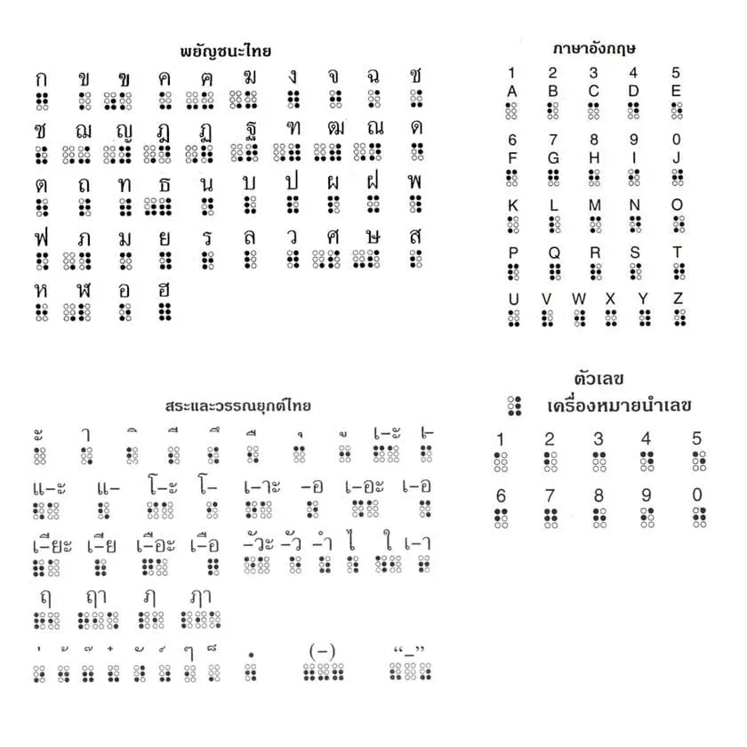

## Meeting 03
## อักษรเบรลล์
- อักษรเบรลล์ (Braille) หรือที่เรียกติดปากว่า “อักษรคนตาบอด” คือ ระบบของจุดที่ยกขึ้นเพื่อให้ผู้พิการทางสายตาหรือคนสายตาเลือนรางสามารถอ่านได้ด้วยนิ้วมือ ครู ผู้ปกครอง และคนอื่น ๆ ที่ไม่ได้มีความบกพร่องทางสายตามักจะอ่านอักษรเบรลล์ด้วยตา อักษรเบรลล์ไม่ใช่ภาษา แต่เป็นรหัสที่ใช้เขียนและอ่านหลายภาษา เช่น อังกฤษ สเปน อาหรับ จีน และอื่น ๆ
## การสร้างคีย์บอร์ด

- คีย์บอร์ดแบบอักษรเบรลล์ (Braille Keyboard / Perkins Style)
หลักการ: ใช้ปุ่มหลักเพียง 6-8 ปุ่ม (เลียนแบบเครื่องพิมพ์ดีด Perkins)

ปุ่ม S, D, F แทนจุด 3, 2, 1
ปุ่ม J, K, L แทนจุด 4, 5, 6
อาจมีปุ่ม Spacebar และ Backspace แยกต่างหาก

การทำงาน: ผู้ใช้จะกดปุ่มหลายปุ่ม "พร้อมกัน" (Chording) เพื่อสร้างเป็นตัวอักษร 1 ตัว
ข้อดี: พิมพ์ได้เร็วกว่าสำหรับผู้ที่ชำนาญอักษรเบรลล์

- หลักการออกแบบ (Design Principles)
ด้านฮาร์ดแวร์ (Hardware)
Texture & Shape: ผิวสัมผัสของปุ่มต้องชัดเจน แยกแยะง่าย อาจมีการใช้รูปทรงปุ่มที่ต่างกันในฟังก์ชันที่ต่างกัน

Feedback (การตอบสนอง):
Tactile: ใช้ Mechanical Switch (เช่น Blue หรือ Brown switch) ที่มีแรงต้านเมื่อกด เพื่อให้ผู้ใช้มั่นใจว่ากดไปแล้ว

Audio: เสียง "คลิก" ของปุ่มสำคัญมาก ช่วยยืนยันการกด
Layout ที่ไม่ซับซ้อน: ตัดปุ่มที่ไม่จำเป็นออก หรือวางตำแหน่งปุ่มสำคัญ (เช่น Enter, Space, Escape) ให้หาง่ายที่สุด

ด้านซอฟต์แวร์ (Software & Logic)
Audio Feedback (สำคัญที่สุด): ทุกครั้งที่กดปุ่ม ระบบต้องมีเสียงตอบกลับ (Text-to-Speech) ว่ากดตัวอะไรไป

State Management: ต้องมีการบอกสถานะ เช่น ตอนนี้กด Shift ค้างไว้ หรือเปิด Caps Lock อยู่ โดยใช้เสียงเตือนที่แตกต่างกัน

Chord Input Support: หากทำแบบ Perkins Style ซอฟต์แวร์ต้องรองรับการกดหลายปุ่มพร้อมกัน (N-Key Rollover) แล้วประมวลผลเป็นตัวอักษรเดียว

- ไอเดียสำหรับการทำโปรเจกต์ (DIY Project Ideas)
หากคุณต้องการลองทำเล่นๆ หรือทำโครงงาน นี่คือแนวทางครับ:

Option 1: สร้างคีย์บอร์ดอักษรเบรลล์ USB (Hardware)
อุปกรณ์: บอร์ด Arduino , Mechanical Switches 6-8 ตัว, 3D Printed Case
การเขียนโค้ด: เขียนโปรแกรมรับค่าการกดปุ่มแบบ Combination แล้วส่งค่า Keycode เข้าคอมพิวเตอร์
ความท้าทาย: การเขียน Logic เพื่อแปลงรหัสจุดเบรลล์ (Braille Dots) เป็น ASCII Code ภาษาไทย/อังกฤษ

Option 2: แอปพลิเคชันคีย์บอร์ดบนหน้าจอสัมผัส (Software)
แนวคิด: บนมือถือไม่มีปุ่มจริง จึงต้องใช้ Braille Screen Input
วิธีทำ: แบ่งหน้าจอมือถือเป็น 6 โซน หรือใช้วิธีแตะนิ้วลงไปจุดไหนก็ได้แล้วระบบจะสร้างตำแหน่งปุ่มให้เองอัตโนมัติ
เครื่องมือ: พัฒนาด้วย Swift (iOS), Kotlin (Android) หรือ Flutter/React Native

Option 3: คีย์บอร์ดสำหรับการเรียนรู้ (Educational)
ทำคีย์บอร์ดที่มีลำโพงในตัว กดปุ่มไหน มีเสียงพูดตัวอักษรนั้นออกมาทันที โดยไม่ต้องต่อคอมพิวเตอร์ (ใช้บอร์ด ESP32 + Module เล่นเสียง MP3)

- เทคโนโลยีที่เกี่ยวข้องที่ควรรู้จัก
Screen Readers: โปรแกรมที่คนตาบอดใช้ (NVDA, TalkBack, VoiceOver) คีย์บอร์ดของคุณต้องทำงานร่วมกับโปรแกรมพวกนี้ได้ดี
Braille Display: อุปกรณ์ขั้นสูงที่เป็นแถบแสดงผลอักษรเบรลล์แบบผุดขึ้นลงได้ (Refreshable) ซึ่งมักจะมีปุ่มพิมพ์เบรลล์ติดมาด้วย

## ผู้เข้าร่วมประชุม
- น.ส.ณัฏฐวรรณ ช่างเก็บ(commit)
- น.ส.ปทิตญา ภูกิจคุณาเดชากร(เลขา)
- น.ส.ประภาภรณ์ ภูผาลี(ประธาน)

